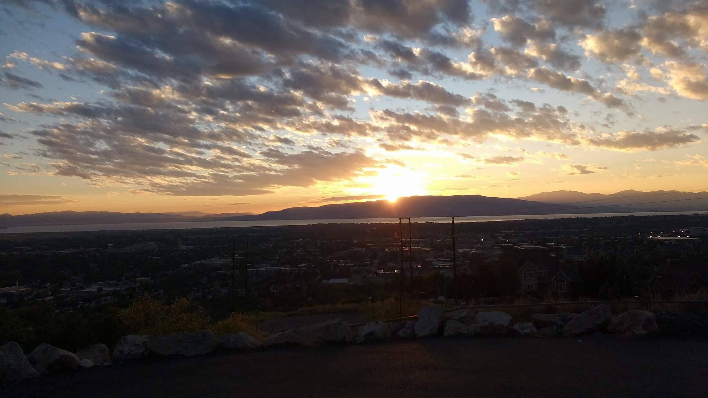

  

# Adam Scott Christensen
## Intro
I made this repository to be a place where I can consolidate my own ideas and hopefully provide insight into my own journey to become well-versed in many fields, from programming and physics, to baking, photography, and writing. Far from being published works of art or expertise, these are explorations, forays into places and things I've always wanted to learn about and do. By documenting that journey here, I hope to implement a lesson I've only been able to really learn by failing frequently at it: that if you don't track your progress, you won't make very much of it.
